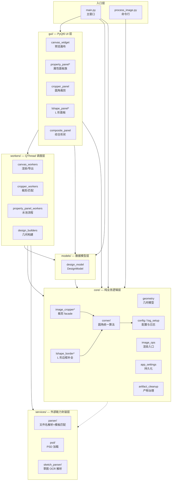
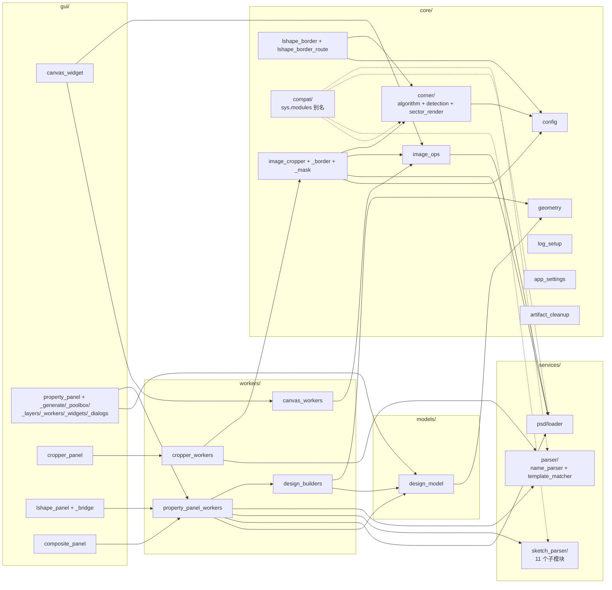
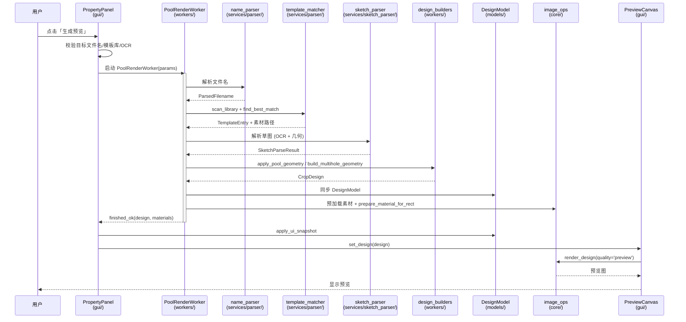
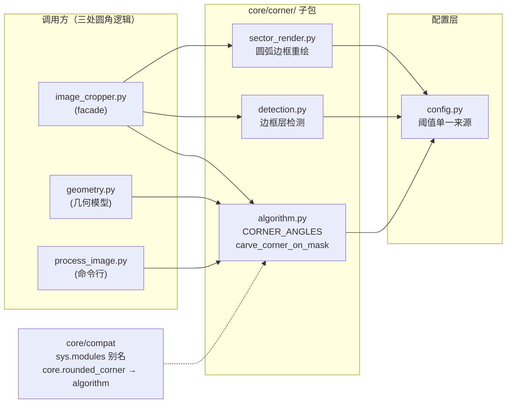
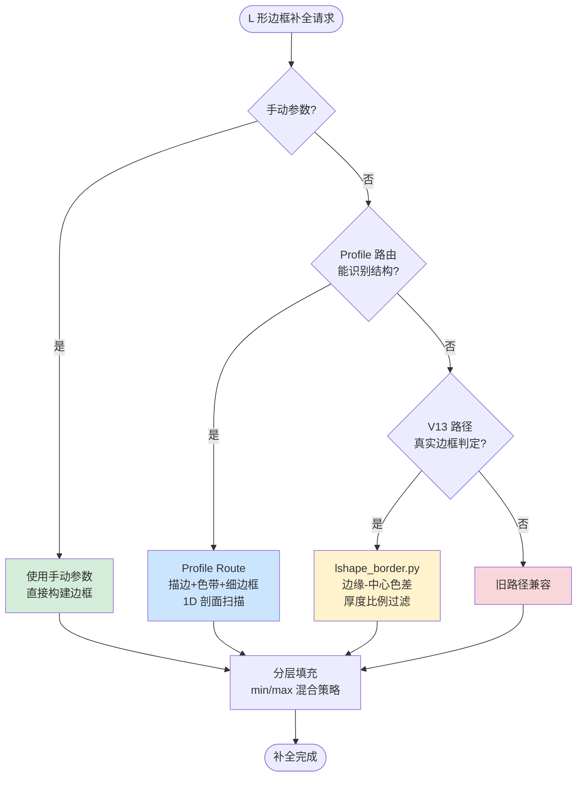

# SmartShapeCrop 模块功能说明

## 项目概览

SmartShapeCrop 是一个面向印刷/定制设计场景的 PyQt5 桌面工具，用于圆角裁剪、水池/嵌套挖洞、草图 OCR、椭圆/多洞/L 形挖角生成与素材边框补全。整体采用分层架构：`core/` 纯业务逻辑 → `services/` 外部能力封装 → `workers/` 后台线程 → `gui/` UI → `models/` 数据模型。

---

## 架构图

### 1. 整体分层架构

依赖方向自上而下：上层可调用下层，下层不反向依赖。`workers/` 与 `gui/` 解耦是核心约束。

**说明：**

项目采用六层分层架构，依赖方向严格自上而下：

- **入口层**：`main.py`（GUI 主窗口，整合各面板）与 `process_image.py`（命令行批处理）。两者都依赖 `core/`，但 `main.py` 额外组装 `gui/` 与 `models/`。
- **gui/ — PyQt5 UI 层**：5 个主要面板（预览画布、属性面板族、圆角裁剪、L 形面板、综合形状）。UI 只负责交互与状态展示，业务逻辑全部下沉。
- **workers/ — QThread 调度层**：4 类 Worker（渲染/导出、裁剪/匹配、水池流程、几何构建）。**核心约束：workers/ 不导入 gui/**，Worker 通过 Qt 信号把结果回传 UI，避免 UI 阻塞与循环依赖。
- **models/ — 数据模型层**：仅 `DesignModel` 一个核心类，包装 `CropDesign`，提供 UI ↔ Design 的双向同步接口。
- **core/ — 纯业务逻辑层**：8 个子模块（几何模型、渲染入口、裁剪 facade、L 形边框补全、圆角算法、配置/日志、持久化设置、产物治理）。
- **services/ — 外部能力封装层**：3 个子包（文件名解析+模板匹配、PSD 加载、草图 OCR 解析）。

依赖关系说明：
- 实线 `-->` 表示直接导入/调用；虚线 `-.->` 表示 `core/` 通过 `core/compat` 的 `sys.modules` 别名机制「透明重定向」到 `services/`（旧路径如 `core.psd_loader` 实际指向 `services.psd.loader`），不增加真实耦合。
- `core/corner` 子包是圆角处理的统一入口，`image_cropper`（裁剪 facade）与 `lshape_border`（L 形边框补全）都依赖它，确保三处圆角逻辑同源。
- `core/config.py` 是阈值与常量的单一来源，`corner`、`image_cropper`、`lshape_border` 都从这里读取参数，避免散落配置导致不一致。

### 2. 模块依赖关系（精细）

展示子模块之间的实际调用关系。`workers/` 不导入 `gui/` 是硬约束；`core/compat` 通过 `sys.modules` 别名重定向旧路径。

**说明：**

此图展示项目子模块之间的真实调用关系，重点揭示几条关键链路：

- **UI → Worker → Service 链路**：`property_panel`（属性面板）→ `property_panel_workers`（Worker）→ `parser` / `sketch_parser` / `psd`（外部能力）。UI 不直接调用 services/，必须经 Worker 中转，保证主线程不阻塞。
- **design_builders 的双重身份**：位于 `workers/` 内，但本质是纯几何构建逻辑（`apply_pool_geometry` / `build_multihole_geometry`），依赖 `geometry`（core）与 `design_model`（models）。它把「UI 参数 → CropDesign」的组装逻辑从 Worker 中抽出，便于单测与复用。
- **三处圆角调用同源**：`image_cropper`（裁剪 facade）、`lshape_border`（L 形边框补全）、`geometry`（几何模型）三者都指向 `corner/` 子包，避免早期版本中 5 份重复「挖正方形 + 填回 1/4 圆」逻辑导致的不一致。
- **core/compat 的虚线重定向**：`compat` 子包通过 `sys.modules` 注册旧路径别名（如 `core.rounded_corner → core.corner.algorithm`、`core.psd_loader → services.psd.loader`），图中虚线表示「路径别名」而非真实依赖。这是 six/future 等标准库常用的兼容手法，调用方迁移到新路径后即可删除。
- **property_panel 的子模块拆分**：`property_panel` 实际由主类 + 6 个 mixin/子模块组成（`_generate`/`_poolbox`/`_layers`/`_workers`/`_widgets`/`_dialogs`），按职责拆分避免单文件膨胀。
- **app_settings 与 artifact_cleanup 的独立性**：这两个模块在依赖图中相对孤立，分别负责持久化设置（QSettings/JSON 双后端）与调试产物清理，被 `main.py` 在启动时调用，不影响核心业务链路。

### 3. 一键生成预览数据流（水池设计器）

展示 `PoolRenderWorker` 的端到端流程：从 UI 触发到画布渲染的完整链路。

**说明：**

时序图展示水池设计器「一键生成预览」的端到端流程，是项目最核心的业务链路。可划分为 6 个阶段：

1. **校验阶段**（`PP → PP`）：属性面板校验目标文件名、模板库路径、OCR 状态。任一缺失则中止并提示用户。
2. **解析阶段**（`PRW → NP / TM / SP`）：Worker 串行调用三个 services：
   - `name_parser` 从文件名解析尺寸/形状（如「50x70 圆形」→ `ParsedFilename`）
   - `template_matcher` 扫描模板库（带磁盘缓存），匹配最相似的素材模板
   - `sketch_parser` 调用 OCR（Tesseract）+ 几何分析，从草图识别外框、内框、边距、多洞布局
3. **几何构建阶段**（`PRW → DB`）：`design_builders.apply_pool_geometry()` / `build_multihole_geometry()` 把解析结果组装为 `CropDesign`，处理多洞布局、间距补偿、全局/逐洞边距。
4. **模型同步阶段**（`PRW → DM`）：把构建好的 design 写回 `DesignModel`，便于后续 UI 编辑与保存。
5. **预加载阶段**（`PRW → IOPS`）：调用 `prepare_material_for_rect()` 预加载素材图（含自动估算纯色边框厚度），避免渲染时重复 IO。
6. **渲染阶段**（`PP → CW → IOPS`）：Worker 通过 `finished_ok` 信号返回 design + materials → 属性面板应用 UI 快照 → 画布调用 `render_design(quality='preview')` 异步渲染（LOD 预览 + 全分辨率两段式）。

**关键设计点：**
- Worker 内的所有业务调用（services/design_builders/image_ops）都不访问 UI，符合 `workers/ 不导入 gui/` 约束。
- Worker 完成后通过 Qt 信号回传，UI 主线程接收到信号后才更新画布，避免阻塞。
- 渲染分两级：先快速 LOD 预览让用户立即看到反馈，再后台渲染全分辨率替换（详见 [gui/canvas_widget.py](gui/canvas_widget.py) 的 `rendered` 信号）。

### 4. 圆角处理一致性链路

所有圆角处理必须经过 `core/corner/algorithm.py`，确保三处圆角逻辑同源。

**说明：**

圆角处理是项目最易出现「逻辑分叉」的环节。早期版本中，`image_cropper.py`、`geometry.py`、`process_image.py` 三处各自实现了「挖正方形 + 填回 1/4 圆」的算法，共 5 份重复代码，导致圆角半径、扇形角度、边缘像素处理不一致。重构后统一收敛到 `core/corner/` 子包：

- **algorithm.py（单步扇形切割）**：定义 `CORNER_ANGLES`（四角 PIL 屏幕坐标系角度映射）、`get_corner_square()`（角落 r×r 正方形区域）、`get_corner_pieslice_bbox()`（pieslice bbox）、`carve_corner_on_mask()`（单步切割：先挖正方形再填回 1/4 圆）。`_angle_in_corner_sector()` 处理 0°/360° 绕接，避免 BR/TR 扇区漏像素。
- **detection.py（边框层自动检测）**：`_detect_border_layers`、`detect_nested_rect_layers`、`_scan_edge_boundaries`、`_get_border_layers_robust`、`classify_gap_layers`、`get_solid_border_colors`。两类检测使用不同阈值是有意为之，分别处理「单图层边框」与「嵌套矩形边框」场景。
- **sector_render.py（圆弧边框重绘）**：`_build_border_sector_mask()`、`_sample_border_color()`、`_redraw_border_on_corner()`。基于径向深度和固定扇区角度生成 bool mask，与 `carve_corner_on_mask` 的 pieslice 角度完全一致，解决圆弧到直线连接区域的漏色问题。

**调用方分工：**
- `image_cropper.py`：裁剪 facade，完整调用 algorithm + detection + sector_render，处理多层边框的动态圆角遮罩。
- `geometry.py`：几何模型层，只调用 algorithm（生成几何参数，不实际操作像素）。
- `process_image.py`：命令行入口，只调用 algorithm（简单圆角，无多层边框重绘）。

**core/compat 的角色：** 旧路径 `core.rounded_corner` 已删除，但通过 `sys.modules` 别名指向 `core.corner.algorithm`，旧调用方无需改动。这是项目「同源保证」的基础——`from core.rounded_corner import f` 与 `from core.corner.algorithm import f` 返回同一个函数对象。

**config.py 的单一来源：** 颜色距离阈值、亮度差分、扫描步长、最大层数、伪层过滤参数等全部集中在 `core/config.py`，三个 corner 子模块都从这里读取，避免散落硬编码导致阈值漂移。

### 5. L 形边框补全多路由优先级

`core/lshape_border_route.py` 与 `core/lshape_border.py` 的路由选择策略。

**说明：**

L 形挖角边框补全是项目最复杂的算法之一。素材图（如窗帘布、墙布的实物照片）四边通常带有多层不同颜色/厚度的边框（描边 + 色带 + 细边框），裁剪后需要在 L 形挖角区域补全这些边框层，使视觉上连续。由于不同素材的边框结构差异极大，单一算法难以覆盖所有场景，因此设计了四条路由按优先级回退：

- **手动参数路由**（绿色，最高优先级）：用户在 UI 手动指定边框层数与厚度时直接使用，跳过自动检测，适用于反复调整或自动检测失效的场景。
- **Profile Route 路由**（蓝色）：[core/lshape_border_route.py](core/lshape_border_route.py) 的新算法，针对「描边 + 色带 + 细边框」复合结构。通过四条边由外向内 1D 颜色剖面扫描 + 滑动平均 + 多扫描线采样，识别多层边框，比 V13 更精细。
- **V13 路由**（黄色）：[core/lshape_border.py](core/lshape_border.py) 的传统算法，通过边缘-中心色差 + 厚度比例过滤花纹误检，`detect_pool_material_borders()` 自动检测边框层（外背景伪边框过滤 → 真实边框判定 → 内容匹配层过滤）。适用于边框结构较简单的素材。
- **旧路径兼容**（红色，最低优先级）：回退到早期实现，保证历史素材的可重现性。

**分层填充的 min/max 混合策略：**

所有路由最终都汇入「分层填充」阶段，这是 L 形边框补全的核心算法。L 形挖角有内凹角（拐角处），分层填充时需要为每一层生成正确的 L 形。早期版本统一使用 `max(dx, dy)`（切比雪夫距离）分层，导致 dy=0（水平切边行）处层深由 dx 单独决定，内层细线溢出到色带区域。

修复后的混合策略（详见 project_memory）：
- `dx <= edge` 时用 `dy` 分层（水平切边优先）
- `dx > edge` 且 `dy < offs[-2]` 时用 `min(dx, dy)`（防止溢出）
- `dx > edge` 且 `dy >= offs[-2]` 时用 `max(dx, dy)`（保证拐角连续）

此策略同时满足「内层不溢出」与「拐角连续」两个约束，Profile Route 与 V13 路径都采用，但阶梯路径 `_draw_staircase_union_layers` 保留原 `max` 策略以维持阶梯几何特性。

---

## 一、顶层文件

### [main.py](main.py)
应用入口，整合主窗口。关键流程：
- `resource_path()`：兼容源码模式与 PyInstaller 打包模式（`sys._MEIPASS`）的资源路径
- `set_app_icon()`：设置全局应用图标（`images/logo.png`）
- `_preset_rect_nested()` 等内置模板：预设样式（矩形嵌套、3 层边框、米色背景等）
- 主窗口组装（[main.py#L134-L190](main.py#L134-L190)）：创建 `PreviewCanvas`、`PropertyPanel`、`CropperPanel`、`LShapePanel`、`CompositePanel`，注册为「圆角裁剪工具/水池设计器/L 形挖角设计/综合形状设计」标签页
- 保存入口（[main.py#L323-L391](main.py#L323-L391)）：导出 JPG 时创建 `ExportSaveWorker`，传入 `design.clone()` 快照

### [process_image.py](process_image.py)
命令行图片处理入口（[process_image.py#L1-L77](process_image.py#L1-L77)）：解析目标尺寸、圆角半径、DPI，执行 `load_source_image()` → 缩放 → `apply_border_only_corners()`，并保存输出 JPG。

### [requirements.txt](requirements.txt)
依赖清单：`PyQt5`、`Pillow`、`numpy`、`psd-tools`、`opencv-python-headless`、`pytesseract` 及测试依赖 `pytest`。

---

## 二、core/ 目录 — 纯业务逻辑层

包说明见 [core/\_\_init\_\_.py](core/__init__.py)，聚合对外 API；子包：`corner`（圆角）、`parser`/`psd`/`pool_designer`（已迁移到 services/ 的兼容 shim）、`config`、`log_setup`、`compat`。

### [core/geometry.py](core/geometry.py)
几何模型层，定义裁剪设计的所有几何数据结构。
- `RectShape` / `EllipseShape` / `LShape`：矩形/椭圆/L 形几何
- `LShape`（[geometry.py#L118-L164](core/geometry.py#L118-L164)）：表达「大矩形 - 角落小矩形」，提供 `cut_specs()`、`cut_rect_specs()`、`cut_rect()`，兼容旧单角与阶梯 `cut_rects`
- `BorderLayer`、`BorderText`、`CropDesign`（[geometry.py#L197-L221](core/geometry.py#L197-L221)）：整体裁剪设计参数（画布尺寸、DPI、模式切换、`rect_lshape` 内外边距与挖角参数）
- `compute_border_bands`、`compute_inner_corner_radii`、`limit_l_cut_rects_per_anchor`（[geometry.py#L24-L80](core/geometry.py#L24-L80)）：按锚定角截断 L 形挖角级数，是几何参数规范化入口

### [core/image_ops.py](core/image_ops.py)
图像加载、适配、渲染的统一入口。
- `load_image_rgb()`：处理 EXIF 方向、RGB 转换
- `fit_image_to_rect()`（[image_ops.py#L26-L59](core/image_ops.py#L26-L59)）：cover/contain/stretch/tile 缩放策略
- `render_design(quality='preview'|'export')`：核心渲染函数
- `save_jpg()`、`prepare_material_for_rect()`
- 自动估算素材图四边纯色边框厚度（[image_ops.py#L112-L160](core/image_ops.py#L112-L160)），避免边框被拉伸成宽色带

### [core/image_cropper.py](core/image_cropper.py)
裁剪服务 facade（编排层）。包含 `CropConfig`、`crop_image`、`batch_crop`。圆角处理统一委托给 `core.corner` 子包，确保与 `geometry.py`、`process_image.py` 三处圆角逻辑完全一致。支持 simple_resize / cover / contain / light_cover / auto 五种裁剪模式。

### [core/image_cropper_border.py](core/image_cropper_border.py)
裁剪服务的「边框重绘 / 边框角处理层」，由 image_cropper.py 拆分而来（facade 模式）。包含 `_redraw_outer_border_on_corners()`：圆角最外轮廓细边的安全补绘。

### [core/image_cropper_mask.py](core/image_cropper_mask.py)
裁剪服务的「掩码构建 / 圆角扇形内容分析层」。包含：
- `_build_multi_layer_corner_mask()`：多层边框动态圆角遮罩，支持「内容区保护模式」
- `_build_border_paint_mask`、`_estimate_outer_background`、`_post_cleanup_gap_regions`

### [core/lshape_border.py](core/lshape_border.py)
L 形挖角边框补全核心算法。
- 真实边框判定逻辑（[lshape_border.py#L44-L115](core/lshape_border.py#L44-L115)）：通过边缘-中心色差、厚度比例过滤花纹误检
- `detect_pool_material_borders()`（[lshape_border.py#L174-L229](core/lshape_border.py#L174-L229)）：从池素材图自动检测边框层（外背景伪边框过滤 → 真实边框判定 → 内容匹配层过滤）
- `_fill_vertical_horizontal`、`_draw_staircase_union_layers`：分层填充策略（混合 min/max 策略修复内凹角溢出问题）

### [core/lshape_border_route.py](core/lshape_border_route.py)
L 形边框补全的多路由版本（[lshape_border_route.py#L13-L34](core/lshape_border_route.py#L13-L34)）。
- 新增「描边 + 色带 + 细边框」结构识别
- 路由优先级：手动参数 → Profile → V13 → 旧路径
- Profile 剖面提取（[lshape_border_route.py#L98-L140](core/lshape_border_route.py#L98-L140)）：四条边由外向内 1D 颜色剖面扫描、滑动平均、多扫描线采样
- `_fill_layers_vertical_horizontal`：分层填充策略（基于混合 min/max 策略修复内凹角细线溢出）

### [core/config.py](core/config.py)
统一配置常量集中管理。
- `APP_VERSION`、`DEFAULT_DPI`、`DEFAULT_BG_COLOR`、`DEFAULT_CROP_MODE`、`DEFAULT_MAX_CROP_RATIO`
- `DEFAULT_BORDER_WIDTH_CM`、`BORDER_TOTAL_DEPTH_CM`
- `cm_to_px()` / `px_to_cm()` 单位换算
- 边框检测阈值（[config.py#L104-L174](core/config.py#L104-L174)）：颜色距离、亮度差分、扫描步长、最大层数、伪层过滤参数（detection.py / sector_render.py 的单一来源）

### [core/log_setup.py](core/log_setup.py)
统一日志配置（[log_setup.py#L42-L112](core/log_setup.py#L42-L112)）。集中设置 root logger、控制台/文件 handler、滚动策略，输出带版本号的启动日志。

### [core/app_settings.py](core/app_settings.py)
基于 QSettings 的应用级持久化设置。优先使用 QSettings，无 Qt 时退化为 JSON 文件。
- 模板库目录历史记录（`TemplateDirHistory`，最近打开目录列表，默认保留 5 条）
- 目标文件名历史（`TargetNameHistory`，按日分组保留 3 天，每天最多 50 条），按 source（cropper/pool/lshape/composite）物理隔离存储
- 全局单例 `get_app_settings()`

### [core/artifact_cleanup.py](core/artifact_cleanup.py)
调试产物目录治理（F19 修复）。双保险策略（保留期 + 数量上限），只作用于白名单调试目录（`debug_output/`、`logs/`），保护 `smartshapecrop.log*`、`crash.log`。`main.py` 启动时调用，异常静默不阻断启动。

### core/corner/ 子包 — 圆角处理统一模块
包说明见 [core/corner/\_\_init\_\_.py](core/corner/__init__.py)。

- [algorithm.py](core/corner/algorithm.py)：单步扇形切割算法。`CORNER_ANGLES`（四角角度映射）、`get_corner_square()`、`get_corner_pieslice_bbox()`、`carve_corner_on_mask()`、`_angle_in_corner_sector()`（处理 0°/360° 绕接）。所有圆角处理必须经过本模块，确保三文件一致性。
- [detection.py](core/corner/detection.py)：边框层自动检测。包含 `_detect_border_layers`、`detect_nested_rect_layers`、`_scan_edge_boundaries`、`_get_border_layers_robust`、`classify_gap_layers`、`get_solid_border_colors`。关键算法在 [detection.py#L60-L179](core/corner/detection.py#L60-L179)：边框层厚度硬约束（过滤内容区伪边框、截断过厚层、丢弃超限层）。
- [sector_render.py](core/corner/sector_render.py)：圆弧上边框层重绘。`_build_border_sector_mask()`、`_sample_border_color()`、`_redraw_border_on_corner()`。基于径向深度和固定扇区角度生成 bool mask（[sector_render.py#L26-L90](core/corner/sector_render.py#L26-L90)），解决圆弧到直线连接区域漏色。

### core/compat/ 子包 — 向后兼容别名
见 [core/compat/\_\_init\_\_.py](core/compat/__init__.py)。通过 `sys.modules` 注册旧导入路径别名，使旧路径继续可用：
- `core.rounded_corner` → `core.corner.algorithm`
- `core.name_parser` / `core.template_matcher` → `services.parser.*`
- `core.psd_loader` / `core.psd` → `services.psd.*`
- `core.parser` → `services.parser`
- `core.pool_designer` → `services.sketch_parser`

时序要求：必须在 `core/__init__.py` 最开头导入，保证后续相对导入能解析到别名。

### core/parser/、core/psd/、core/pool_designer/
均为兼容 shim（实际模块已迁移到 services/），目录占位 + 安全网。

---

## 三、services/ 目录 — 外部能力封装层

### services/parser/ — 文件名解析与模板匹配

- [name_parser.py](services/parser/name_parser.py)：
  - `ParsedFilename` 模型（[name_parser.py#L22-L57](services/parser/name_parser.py#L22-L57)）：竖版/横版尺寸映射、`oriented_outer_w_h_cm()` 输出语义
  - 解析逻辑（[name_parser.py#L77-L168](services/parser/name_parser.py#L77-L168)）：花型名提取、形状关键词识别、尺寸字符串解析（圆/直径/矩形尺寸）

- [template_matcher.py](services/parser/template_matcher.py)：
  - `TemplateEntry`（[template_matcher.py#L79-L157](services/parser/template_matcher.py#L79-L157)）：模板库条目建模与解析字段缓存，保存文件名解析结果、尺寸比例桶、圆角标记
  - 磁盘缓存容器（[template_matcher.py#L252-L260](services/parser/template_matcher.py#L252-L260)）：保存模板目录 mtime、解析条目、pattern/layout/circular 等倒排索引
  - `scan_library` / `find_best_match`：模板库扫描与匹配

### services/psd/ — PSD 文件加载与导出

- [loader.py](services/psd/loader.py)：
  - `PsdLayer`（[loader.py#L33-L73](services/psd/loader.py#L33-L73)）：图层数据模型，保存可见性、bbox、RGBA 内容，提供自动裁剪透明边缘、RGBA→RGB 合成
  - `is_psd_file()` / `load_psd_layers()`（[loader.py#L85-L134](services/psd/loader.py#L85-L134)）：使用 psd-tools 读取 PSD/PSB 图层，跳过组，保留叶子图层
  - `load_psd_flattened()`（[loader.py#L137-L208](services/psd/loader.py#L137-L208)）：PSD 合成为 RGB/JPG 图像
  - `export_psd_layers_as_jpgs()`：批量导出图层素材

### services/sketch_parser/ — 草图/OCR 解析子包

包含 11 个文件，覆盖单洞、多洞、L 形、综合形状的草图解析：

- [sketch_parser.py](services/sketch_parser/sketch_parser.py)：单洞草图解析主入口。`SketchParseResult` 模型（[sketch_parser.py#L43-L70](services/sketch_parser/sketch_parser.py#L43-L70)）；外框尺寸候选评分（[sketch_parser.py#L138-L161](services/sketch_parser/sketch_parser.py#L138-L161)）；`_step6_5_ratio_swap()` 方向/比例纠错（[sketch_parser.py#L212-L250](services/sketch_parser/sketch_parser.py#L212-L250)）
- [sketch_parser_base.py](services/sketch_parser/sketch_parser_base.py)：解析器基类
- [sketch_parser_cache.py](services/sketch_parser/sketch_parser_cache.py)：解析结果缓存
- [sketch_parser_margins.py](services/sketch_parser/sketch_parser_margins.py)：几何自洽评分 `_score_assignment_consistency()`（[sketch_parser_margins.py#L25-L86](services/sketch_parser/sketch_parser_margins.py#L25-L86)），根据 outer = inner + margins 一致性打分
- [sketch_parser_multihole.py](services/sketch_parser/sketch_parser_multihole.py)：多洞草图解析。`HoleInfo` / `MultiHoleParseResult`（[sketch_parser_multihole.py#L108-L145](services/sketch_parser/sketch_parser_multihole.py#L108-L145)）
- [sketch_parser_numbers.py](services/sketch_parser/sketch_parser_numbers.py)：方向标签与 OCR 数值处理。方向字符→margin 字段映射，小数合并修复（[sketch_parser_numbers.py#L52-L57](services/sketch_parser/sketch_parser_numbers.py#L52-L57)）
- [sketch_parser_vision.py](services/sketch_parser/sketch_parser_vision.py)：草图图像加载与 OCR 预处理。支持 OpenCV/PIL 读取、中文路径兼容（[sketch_parser_vision.py#L130-L160](services/sketch_parser/sketch_parser_vision.py#L130-L160)）；`_enhance_colored_ink()` 彩色笔迹增强、`_build_binary_masks()` 二值化（Otsu/Canny/自适应阈值，[sketch_parser_vision.py#L172-L250](services/sketch_parser/sketch_parser_vision.py#L172-L250)）
- [lshape_sketch_parser.py](services/sketch_parser/lshape_sketch_parser.py)：L 形/挖角草图解析。`LSketchParseResult` 模型（[lshape_sketch_parser.py#L51-L71](services/sketch_parser/lshape_sketch_parser.py#L51-L71)）；凹角检测与筛选（滑动窗口凹度计算、bbox 四角约束、cut 比例硬约束、多候选分桶，[lshape_sketch_parser.py#L153-L260](services/sketch_parser/lshape_sketch_parser.py#L153-L260)）
- [composite_sketch_parser.py](services/sketch_parser/composite_sketch_parser.py)：综合形状草图解析。使用 `RETR_CCOMP` 层级轮廓策略识别外框与中心洞（[composite_sketch_parser.py#L84-L126](services/sketch_parser/composite_sketch_parser.py#L84-L126)）；`_composite_zone_func()` 将 OCR 数值按空间位置归入角色桶（[composite_sketch_parser.py#L129-L174](services/sketch_parser/composite_sketch_parser.py#L129-L174)）；`_resolve_axis()` 单轴整体决策（[composite_sketch_parser.py#L191-L216](services/sketch_parser/composite_sketch_parser.py#L191-L216)）
- [_sketch_init.py](services/sketch_parser/_sketch_init.py)：子包初始化

---

## 四、gui/ 目录 — PyQt5 UI 层

包说明见 [gui/\_\_init\_\_.py](gui/__init__.py)，导出 `PreviewCanvas`、`PropertyPanel`、`CropperPanel`、`LShapePanel`、`CompositePanel`。

### [gui/canvas_widget.py](gui/canvas_widget.py)
主预览画布组件。`PreviewCanvas`（[canvas_widget.py#L38-L70](gui/canvas_widget.py#L38-L70)）显示当前 `CropDesign`，设置设计后更新凹角/多洞叠加层并触发异步渲染。异步分级渲染流程（[canvas_widget.py#L146-L212](gui/canvas_widget.py#L146-L212)）：先快速显示 LOD 预览，再后台渲染全分辨率，完成后替换预览并发送 `rendered` 信号。

### [gui/property_panel.py](gui/property_panel.py)
右侧属性面板核心类 `PropertyPanel`（[property_panel.py#L38-L46](gui/property_panel.py#L38-L46)）。定义 `design_changed`、`save_requested`、`sketch_loaded` 等信号，是水池设计器/生成预览/保存导出的中枢。包含「画布尺寸 + 裁剪模式」区域（[property_panel.py#L258-L286](gui/property_panel.py#L258-L286)）：矩形嵌套挖洞、L 形挖角、椭圆挖洞、综合形状（挖角+中心洞）模式切换。

### 按职责拆分的 property_panel_*.py 子模块
- [property_panel_generate.py](gui/property_panel_generate.py)：`_GenerateMixin` 一键生成预览入口。`_pool_run_generate()`（[property_panel_generate.py#L41-L68](gui/property_panel_generate.py#L41-L68)）支持 pool/lshape/composite 来源；Worker 启动逻辑（[property_panel_generate.py#L120-L196](gui/property_panel_generate.py#L120-L196)）校验目标文件名、模板库、OCR 状态、读取边距/多洞参数、启动 `PoolRenderWorker`
- [property_panel_poolbox.py](gui/property_panel_poolbox.py)：水池/多洞 UI 组件
- [property_panel_layers.py](gui/property_panel_layers.py)：图层管理 UI
- [property_panel_workers.py](gui/property_panel_workers.py)：属性面板内部 Worker 桥接
- [property_panel_widgets.py](gui/property_panel_widgets.py)：通用 widget
- [property_panel_dialogs.py](gui/property_panel_dialogs.py)：草图查看对话框 `_SketchViewerDialog`（[property_panel_dialogs.py#L31-L94](gui/property_panel_dialogs.py#L31-L94)）：适应窗口/原尺寸/放大缩小/关闭，支持滚轮缩放（[property_panel_dialogs.py#L116-L189](gui/property_panel_dialogs.py#L116-L189)）

### [gui/cropper_panel.py](gui/cropper_panel.py)
圆角裁剪工具面板（上传 → 文件名解析 → 模板匹配 → 预览 → 导出）。

### [gui/lshape_panel.py](gui/lshape_panel.py)
独立 L 形挖角设计面板 `LShapePanel`（[lshape_panel.py#L40-L57](gui/lshape_panel.py#L40-L57)）：承载 L 形挖角参数、草图上传、识别、生成、保存等 UI 与信号，不再依赖水池面板。

### [gui/lshape_panel_bridge.py](gui/lshape_panel_bridge.py)
L 形面板与其他模块的桥接层。

### [gui/composite_panel.py](gui/composite_panel.py)
综合形状面板 `CompositePanel`（[composite_panel.py#L21-L43](gui/composite_panel.py#L21-L43)）。复用 L 形面板的草图/目标文件/挖角控件，隐藏 L 形专用识别区并构建综合形状控制逻辑。包含 `get_composite_params()`（[composite_panel.py#L117-L176](gui/composite_panel.py#L117-L176)）：中心矩形洞、边距、素材填充等输入；草图识别入口（[composite_panel.py#L212-L240](gui/composite_panel.py#L212-L240)）：校验草图与尺寸基准后启动 `_CompositeParseWorker`。

---

## 五、workers/ 目录 — 后台线程调度层

包说明见 [workers/\_\_init\_\_.py](workers/__init__.py)。Worker 只做：启动 → check_cancel → 转发结果；业务逻辑委托 services/ 和 core/；与 GUI 解耦，**不导入任何 gui/ 模块**。

- [canvas_workers.py](workers/canvas_workers.py)：
  - `PreviewRenderWorker`（[canvas_workers.py#L16-L42](workers/canvas_workers.py#L16-L42)）：后台 QThread 渲染 Worker，调用 `core.image_ops.render_design(quality='preview')`，通过 `finished_ok/finished_err` 信号返回结果
  - `ExportSaveWorker`（[canvas_workers.py#L44-L91](workers/canvas_workers.py#L44-L91)）：后台导出线程，执行全分辨率 `render_design(quality='export')` 并同线程写入 JPG
- [cropper_workers.py](workers/cropper_workers.py)：
  - `CropWorker`（[cropper_workers.py#L17-L48](workers/cropper_workers.py#L17-L48)）：异步裁剪 Worker，将 `crop_image()` 移至后台线程
  - `AutoMatchWorker`（[cropper_workers.py#L50-L103](workers/cropper_workers.py#L50-L103)）：异步模板匹配 Worker，通过 `progress/log_msg/finished_ok/finished_err` 信号与 UI 交互
- [property_panel_workers.py](workers/property_panel_workers.py)：
  - `_SketchDecodeWorker`（[property_panel_workers.py#L45-L83](workers/property_panel_workers.py#L45-L83)）：后台解码上传草图
  - `_InnerMatchWorker`（[property_panel_workers.py#L85-L235](workers/property_panel_workers.py#L85-L235)）：后台内挖素材自动匹配
  - `PoolRenderWorker`（[property_panel_workers.py#L273-L393](workers/property_panel_workers.py#L273-L393)）：水池设计一键流程 Worker，按步骤解析文件名 → 匹配模板 → 解析草图 → 构建 CropDesign → 预加载素材
- [design_builders.py](workers/design_builders.py)：设计构建逻辑（Worker/UI 之间传递纯参数的 DTO 与几何构建函数）
  - `PoolBuildParams`、`LShapeBuildParams`、`CompositeBuildParams`、`LegacyBuildSnapshot`（[design_builders.py#L20-L43](workers/design_builders.py#L20-L43)）
  - `apply_lshape_geometry()`（[design_builders.py#L46-L93](workers/design_builders.py#L46-L93)）：L 形挖角模式设计构建
  - `build_multihole_geometry()`（[design_builders.py#L95-L260](workers/design_builders.py#L95-L260)）：多洞水池几何构建核心（多洞布局、间距补偿、全局/逐洞边距）
  - 多洞 UI 覆盖逻辑（[design_builders.py#L263-L365](workers/design_builders.py#L263-L365)）：用户手动修改多洞参数时重新计算每洞宽高、间距和坐标
  - `apply_pool_geometry()` / `apply_composite_geometry()`（[design_builders.py#L369-L428](workers/design_builders.py#L369-L428)）：水池/综合形状构建入口

---

## 六、models/ 目录 — 数据模型层

包说明见 [models/\_\_init\_\_.py](models/__init__.py)，纯数据结构，不含 UI 引用和业务逻辑。

- [design_model.py](models/design_model.py)：`DesignModel` 核心包装器（[design_model.py#L23-L55](models/design_model.py#L23-L55)）。持有 `CropDesign`，提供 `sync_from_design()`、`to_design()` 和属性访问，是模型层与 UI/Worker 交互的入口。`apply_ui_snapshot()`（[design_model.py#L136-L164](models/design_model.py#L136-L164)）：UI 传纯值 snapshot，模型层按 common/lshape/pool 分支写入。水池模式字段同步（[design_model.py#L239-L284](models/design_model.py#L239-L284)）和多洞模型重建（[design_model.py#L287-L419](models/design_model.py#L287-L419)）：按激活洞数重建 `pool_holes_cm` / `pool_holes_gaps_cm`，并逐洞继承素材字段。

---

## 七、辅助目录（简要）

- `tests/`：pytest 测试，详见 AGENTS.md「按改动范围跑针对性测试」映射表
- `scripts/`：人工诊断和验证脚本，不进 CI
- `packaging/`：PyInstaller 打包入口（`packageV2.2.5.py`）与 spec
- `ProductSummary/`：历史和产品文档
- `images/`：资源图片（如 `logo.png`）
- `logs/`、`debug_output/`：调试产物（由 `core/artifact_cleanup.py` 治理）

---

## 架构边界与关键约束

1. **分层依赖**：`workers/` 不应导入 `gui/`；业务逻辑集中在 `core/`，外部能力封装在 `services/`
2. **圆角一致性**：所有圆角处理必须经过 [core/corner/algorithm.py](core/corner/algorithm.py)，确保 `image_cropper.py`、`geometry.py`、`process_image.py` 三处逻辑一致
3. **向后兼容**：`core/compat/` 通过 `sys.modules` 别名重定向旧导入路径，文件已删除但导入仍可用
4. **配置单一来源**：边框检测阈值集中在 [core/config.py](core/config.py)
5. **L 形边框补全多路由**：手动参数 → Profile（[core/lshape_border_route.py](core/lshape_border_route.py)）→ V13（[core/lshape_border.py](core/lshape_border.py)）→ 旧路径
6. **持久化双后端**：[core/app_settings.py](core/app_settings.py) 优先 QSettings，无 Qt 时退化为 JSON 文件
