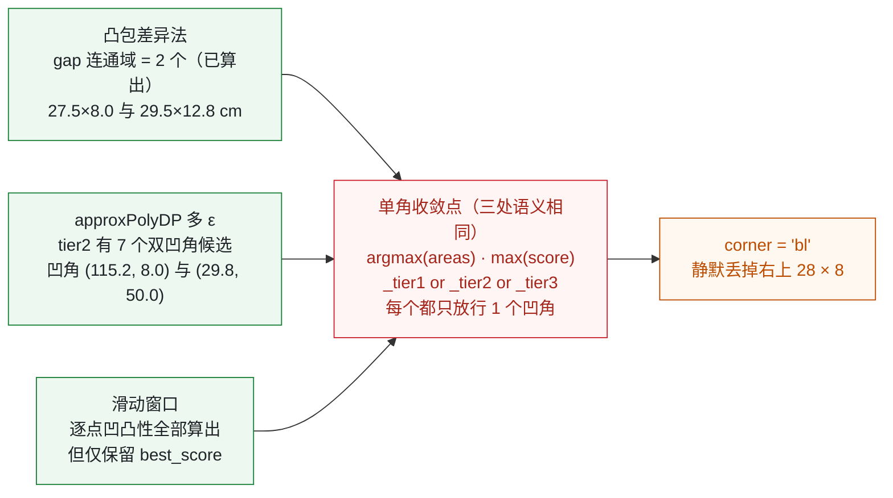
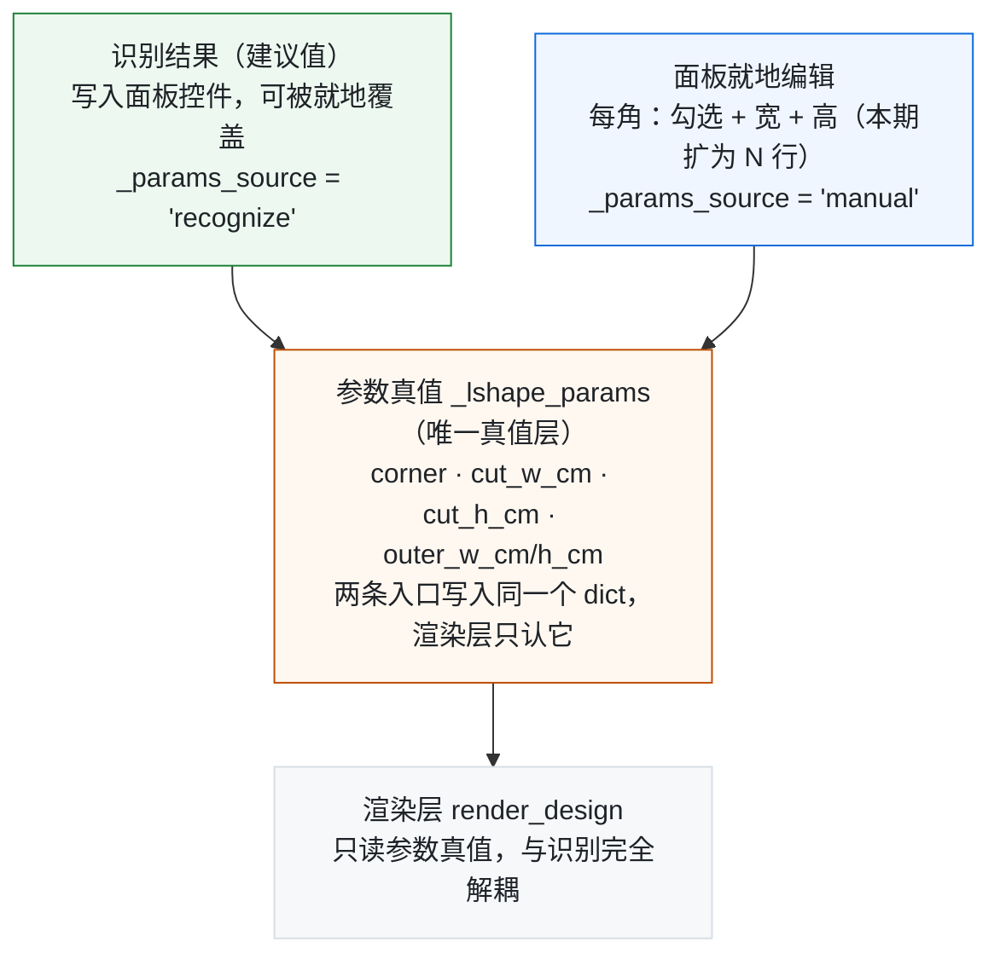

# SmartShapeCrop 多角 L 形挖角可行性分析 V1.1

> L 形面板「单角挖角 → 多角复合挖角」扩展评估；本版新增识别层实测复检、闸口设计与手动修正通路

| 项 | 值 |
|---|---|
| 报告版本 | **V1.1** |
| 日期 | 2026-09-14 |
| 项目版本 | V2.2.1 |
| 基线 commit | `44c4fd1` |
| 性质 | 只读分析 · 未改动任何代码 |
| 替代 | V1.0（同日） |

> 本文档由同名 HTML 报告转换而来，便于检索与就地编辑。
> 原报告中的 3 张内嵌 SVG 在此以 Mermaid 图与 ASCII 示意图表达，信息等价。
> 对应 HTML：`SmartShapeCrop-多角L形挖角可行性分析-V1.1-20260914.html`

---

## 目录

0. [V1.1 相对 V1.0 的修订](#0-v11-相对-v10-的修订)
1. [结论摘要](#1-结论摘要)
2. [需求还原：草图尺寸链与几何本质](#2-需求还原草图尺寸链与几何本质)
3. [现状：单 corner 硬编码点全清单](#3-现状单-corner-硬编码点全清单)
4. [难度分层：钱花在哪一层](#4-难度分层钱花在哪一层)
5. [识别层实测复检（V1.1 新增）](#5-识别层实测复检v11-新增)
6. [闸口设计（V1.1 新增）](#6-闸口设计v11-新增)
7. [手动修正通路（V1.1 新增）](#7-手动修正通路v11-新增)
8. [关键决策：扩展现有面板 vs 单开面板](#8-关键决策扩展现有面板-vs-单开面板)
9. [分期实施路线](#9-分期实施路线)
10. [风险清单与缓解措施](#10-风险清单与缓解措施)
11. [验收证据与待拍板事项](#11-验收证据与待拍板事项)

---

## 0. V1.1 相对 V1.0 的修订

| 项目 | V1.0 | V1.1 | 依据 |
|---|---|---|---|
| 识别层工作量 | 7–10 天（列为「硬骨头 ②」） | **3–5 天** | §5 实测复检 |
| 硬骨头数量 | 2 层 | **1 层**（仅边框补全） | §5 实测复检 |
| 预计总工期 | 3–4 周 | **2.5–3 周** | §4 + §5 |
| 识别层章节 | 无（仅文字描述） | §5 三条通道逐条实测 | 新增 |
| 闸口设计 | 无 | §6 三级闸口 G1/G2/G3 | 新增 |
| 手动修正通路 | 无 | §7 架构现状 + 缺口 + 修正能力矩阵 | 新增 |
| 第一期范围 | 完全跳过识别，全手动填数 | 解除三个单角收敛点，识别给出**角落 + 尺寸建议值**；仅 OCR 精确归属推后 | §9 策略修正 |

> **V1.0 的核心估算错误：把「草图识别多角化」当成了需要从零发明算法的活。**
> §5 的实测证明，**多挖角的几何数据现有代码早已算出**——凸包差异法算出 2 个连通域、
> approxPolyDP 的 tier2 里躺着 7 个双凹角候选，只是被三个「单角收敛点」掐成了 1 个。
> 这不是算法问题，是优先级问题。

---

## 1. 结论摘要

> **复杂度判定：中等，成本高度集中。几何层不难；识别层经实测复检后大幅降级；钱仍然花在「边框补全走线」一层。**
>
> - 多角挖角在几何上就是 `矩形 − cut₁ − cut₂ − …` 的布尔差集，mask 差集天生支持复合挖角；
> - 识别层三条并行通道**均已算出多角数据**，改造语义收敛为一句话：把三处「单角收敛」换成「按 bbox 四角分桶」；
> - 真正的难点只剩 `core/lshape_border.py` —— 有 **6 个函数被 `cut_corner` 字符串贯穿**。

### KPI

| 指标 | 值 | 备注 |
|---|---|---|
| 实现复杂度 | **中等** | 5 层轻活 + 1 层硬骨头 |
| 预计总工作量 | **2.5–3 周** | ↓ 原估 3–4 周 |
| 硬骨头 | **1 层** | 边框补全走线 |
| 识别层 | **3–5 天** | ↓ 原估 7–10 天 |
| 本次代码改动 | **0 行** | 只读分析 |

### 一句话结论

> **建议在现有 L 形面板内扩展，不要单开面板。**
> 多角挖角与单角挖角属于**同一参数族**（1 个 cut → N 个 cut），
> 共用同一套几何、渲染、边框与历史链路；新开面板解决不了那个硬骨头，
> 只会多出一份 UI 代码、多一套历史记录源、多一处穿透读写 ——
> 正是《多洞面板拆分可行性分析 V1.0》中点名的「寄生 + 多链路穿透」结构。

### 三条设计主线（V1.1 新增）

| 主线 | 要点 | 章节 |
|---|---|---|
| **解除收敛** | 识别层不需要新算法，只需把 `argmax` / `or 短路` / `max` 三处收敛换成按 bbox 四角分桶 | §5 |
| **加装闸口** | 现有失效模式是「静默丢掉一个角，却报告识别成功」。需 G1 结构一致性 / G2 置信度 / G3 人工核对三级闸口 | §6 |
| **兜底修正** | 手动修正通路 **2026-09-03 就已铺好**（识别只写建议值，用户可就地编辑），本期只需扩为 N 行 + 保留 geometry 提示 | §7 |

> **过渡方案（可先顶着）：** 若多角挖角目前只是零星定制单，按项目文档
> `L形挖角已知问题与后续规划.md` 中 SR-3 的缓解措施 ——
> **单角渲染两次 + 外部合成**即可交付。待频次上升再启动正式改造。

---

## 2. 需求还原：草图尺寸链与几何本质

### 2.1 草图尺寸链解析

需求草图：`双面格-定制-裁剪有图-简织;62.8x143CM裁剪有图.png`。
文件名给出的板材尺寸 **62.8 × 143 CM** 与图内标注**完全自洽**：

| 方向 | 图上标注 | 尺寸链求和 | 与板材尺寸比对 |
|---|---|---|---|
| 上边（宽） | 115 + 28 | = 143 | ✓ 吻合 |
| 下边（宽） | 113 + 30 | = 143 | ✓ 吻合 |
| 左边（高） | 50 + 12.8 | = 62.8 | ✓ 吻合 |
| 右边（高） | 8 + 54.8 | = 62.8 | ✓ 吻合 |

由此可唯一还原出两个挖角参数：

| 挖角 | 位置 | 挖角宽度 cut_w | 挖角高度 cut_h | 对应现有字段 |
|---|---|---|---|---|
| 挖角 ① | 右上角 `tr` | 28 cm | 8 cm | `corner='tr'` |
| 挖角 ② | 左下角 `bl` | 30 cm | 12.8 cm | `corner='bl'` |

> 两个挖角**方位不同（对角）、尺寸不同**，正是现有 `LShapeDesign`
> （单 corner + 单 cut_w/h）无法表达的场景。

### 图 1　草图几何还原（示意图，非等比）

> 红色虚线框为被挖掉的角，★ 为新产生的凹角。

```
        x=0                 x=115        x=143
  y=0    ●───────────────────┐
         │                   │  ← 虚线：被切掉的边（原板材轮廓）
         │                   └───────────●
  y=8    │                               │
         │                               │
         │        板材 143 × 62.8        │
         │        ★ 凹角 ① (115, 8)      │
         │        ★ 凹角 ② (30, 50)      │
         │                               │
  y=50   ●───────────┐                   │
         │           │                   │
         │           └───────────────────●
  y=62.8 │          x=30               x=143

  尺寸链：
    上边  115 + [28] = 143          右边  [8] + 54.8 = 62.8
    下边  [30] + 113 = 143          左边  50 + [12.8] = 62.8
    → 挖角① tr = 28 × 8      挖角② bl = 30 × 12.8
```

轮廓顶点（cm，共 8 个）：
`(0,0) → (115,0) → (115,8) → (143,8) → (143,62.8) → (30,62.8) → (30,50) → (0,50) → 闭合`

> 可见凹角 2 处 → 轮廓 8 顶点。**现有单角路径只支持 6 顶点。**

### 2.2 几何本质：纯布尔差集，这层不复杂

现有 `build_lshape_mask()` 的算法是「填充外框 → 用相反值挖掉 cut_rect → 处理圆角」。
多角只是在第 2 步**多挖几个矩形**：

```python
# core/geometry.py:620 现有实现（单 cut）
fill_rect_mask(m, outer_rect, fill_value)
cut = _get_lshape_cut_rect_at_offset(outer_rect, corner_key, cut_w, cut_h, 0)
if has_cut:
    fill_rect_mask(m, cut, other)          # ← 挖掉一个角

# 多角改造方向：循环即可，mask 差集天然支持复合
for ck, cw, ch in cuts:                    # ← cuts 为挖角列表
    cut = _get_lshape_cut_rect_at_offset(outer_rect, ck, cw, ch, 0)
    if cut.w > 0.5 and cut.h > 0.5:
        fill_rect_mask(m, cut, other)
```

这也是为什么本报告把「几何 layer」判为**易**：
多边形布尔运算本身不需要新算法，只需要把单值参数换成列表。

---

## 3. 现状：单 corner 硬编码点全清单

以下为本次**逐文件通读**得到的单角硬编码点，共 **7 层 / 9 个文件 / 12 处**：

| # | 层 | 文件 : 行 | 硬编码形态 | 多角改造动作 |
|---|---|---|---|---|
| 1 | 数据模型 | `core/geometry.py:60-68` | `LShape.corner` 单值 + `cut_w/cut_h` 标量 | 改为挖角列表 |
| 2 | 数据模型 | `core/geometry.py:136-138` | `CropDesign.l_corner / l_cut_w_cm / l_cut_h_cm` | 新增列表字段，保留旧字段兼容 |
| 3 | 取值入口 | `core/geometry.py:303` | `l_shape_px()` 返回**单个** LShape | 新增 `l_shapes_px()` 返回列表 |
| 4 | 几何 mask | `core/geometry.py:620` | 单 cut_rect + 单 `opposite_map` 内部拐角 | 循环挖角 + 每个 cut 独立算内部拐角 |
| 5 | 边框带 | `core/geometry.py:689` | `compute_lshape_border_bands` 两同心 L mask 差集 | mask 已支持，抽样点需扩充 |
| 6 | 渲染主链路 | `core/image_ops.py:737,783,1068` | 三处 `mode=='rect_lshape'` 单实例分支 | 循环化 |
| 7 | 渲染主链路 | `core/image_ops.py:810-829` | 挖角区 `_extra` 四分支 if-elif | 循环化（4 分支 → N 次） |
| 8 | 边框补全 | `core/lshape_border.py:236,265-328` | `compute_cut_edge_bboxes` 四分支 | **逐凹角处理** |
| 9 | 边框补全 | `core/lshape_border.py:365,413-441` | `draw_border_layers_on_cut_edges` 由 cut_corner 定边缘侧 | **逐凹角处理** |
| 10 | 边框补全 | `core/lshape_border.py:525,858,1115` | `apply_lshape_border_completion` / `_apply_v13_path` / `patch_lshape_cut` 全部贯穿 cut_corner，靠 `flipx/flipy` 镜像 | **逐凹角处理（最大工作量）** |
| 11 | 草图识别 | `services/sketch_parser/lshape_sketch_parser.py` | 单凹角检测 + 双锚点四象限投票 → 单 corner | **解除收敛（详见 §5）** |
| 12 | GUI 面板 | `gui/lshape_panel.py:233-239` | 1 个 QComboBox + 2 个 SpinBox | N 行「每角：勾选 + 宽 + 高」 |

> **注意 `if corner == 'tl' / elif 'tr' / elif 'bl' / else 'br'` 这一模式在 core 层反复出现。**
> 它意味着「四分支 if-elif 链」是多角改造的主要重复劳动 ——
> 每一处都要从「四选一」改成「对每个挖角各执行一次」。

---

## 4. 难度分层：钱花在哪一层

### 4.1 工作量分布（V1.1 更新）

```
数据模型        ██ 0.5d                                        易
几何 mask       ███ 1d                                         易
GUI 面板        ███ 1d                                         易
渲染主链路      ████████ 2–3d                                  中
边框带差集      ███████ 2d                                     中
草图识别        ███████████ 3–5d      （原估 7–10d）            中
边框补全走线    ██████████████████████████ 7–10d               难  ← 唯一硬骨头
```

7 层中 **5 层是轻活**（合计约 5 天）；**边框补全走线一层独占约一半工期**；
草图识别经 §5 实测复检后由「最难」降为「中」，从 7–10 天下修到 3–5 天。
这个分布决定了实施策略：**先做轻活 5 层 + 解除识别收敛，把边框补全留到第二期**。

### 4.2 硬骨头 ①　`core/lshape_border.py` —— 素材边框补全与走线

> **风险等级：高｜7–10 天｜唯一硬骨头**

**为什么难**

`cut_corner` 作为字符串参数**贯穿 6 个函数**：
`compute_cut_edge_bboxes` → `draw_border_layers_on_cut_edges`
→ `apply_lshape_border_completion` → `_apply_v13_path`
→ `patch_lshape_cut`，内部靠 `flipx/flipy` 按角做镜像，
还要从原素材图检测边框带、按外→内分层重绘。

**多角带来的新问题**

1. 每个凹角都要**独立走一遍**边框带检测 + 补边；
2. 相邻挖角在外框上共享边段时，边框带会**重叠冲突**；
   本例两个凹角分别落在左边与右边上（对角），冲突风险较低 —— 但四角同挖时必须处理。

**建议**

分期支持：**先只做「对角两挖角」**（覆盖本例），相邻角推后。

### 4.3 已降级　`lshape_sketch_parser.py` —— 识别层不再算硬骨头

> **风险等级：中｜3–5 天**

| 项 | 内容 |
|---|---|
| **V1.0 的判断** | 曾列为「硬骨头 ②」，理由是「现有算法是整图找**唯一**凹角，多角需升级为找出全部凹角 → 各自配对算 cut_w/cut_h → 把 OCR 尺寸标注归属到正确的角」，估 7–10 天。 |
| **V1.1 修正** | **前半段（找全部凹角 + 各自配对）实测证明现有代码已经做完了** —— 多角数据就存在，只是被三个「单角收敛点」掐成 1 个（详见 [§5](#5-识别层实测复检v11-新增)）。真正需要动脑的只剩**后半段：OCR 尺寸标注逐角归属**（A/B/C/D/E/F 六角色泛化为「每角一组」），这才是 3–5 天的主体，也才是 SR-1 风险所在。 |
| **结论** | 从「算法攻关」降级为「解除收敛 + 归属泛化」。第一期即可顺手解除收敛（约 0.5 天），让识别先给出「有几个角、在哪个角、尺寸约多少」的建议值。 |

---

## 5. 识别层实测复检（V1.1 新增）

> 本节是 V1.1 全部修订的证据来源。
> **方法**：用需求草图的真实尺寸链构造合成草图
> （板材 143 × 62.8 cm，比例 4 px/cm，轮廓 8 顶点，右上挖 28×8、左下挖 30×12.8），
> 直接调用现有识别函数 `_detect_lshape_geometry()` 与 `_collect_approx_candidates()`，
> 观察它们各自返回什么。

### 5.1 实测结果 A：现有函数静默丢失第二个挖角

调用 `_detect_lshape_geometry(cv2, gray)`，返回：

```
corner    = 'bl'
cut_w_px  = 118.0     cut_h_px  = 51.0
cut_w_cm  = 29.50     cut_h_cm  = 12.75     ← 真值 30 × 12.8，吻合
n_verts   = 6                               ← 单 L 形的顶点数
```

> **这是本次复检最重要的发现，也是最危险的失效模式。**
>
> 函数**只识别出左下角（bl）一个挖角**，右上角那个 28 × 8 **被完全丢弃**——
> 而且它**没有报错、没有告警、没有返回 None**。
> 因为尺寸落在有效区间内，`parse_lshape_sketch` 会把 `result.success` 置为 **True**，
> 状态栏显示「L 形识别成功（corner=bl, 挖角 29.5×12.75cm, 自洽=…）」。
>
> 也就是说：**用户会拿到一个看起来完全正常的成功提示，但成品少挖了一个角。**
> 这正是 §6 闸口设计要防的东西。

### 图 2　三条通道均已算出多挖角数据，只在收敛点被截断为 1 个



> 绿 = 已算出的可用数据，红 = 收敛点，橙 = 实际输出。

### 5.2 实测结果 B：三条通道的多角数据逐条核对

| 通道 | 代码位置 | 实际算出了什么（实测） | 收敛点 | 可用性 |
|---|---|---|---|---|
| **凸包差异法** | `_detect_by_convex_hull:306` | `gap = hull − contour` 的连通域**恰好 2 个**：<br>区域① 27.5 × 8.0 cm，触碰【右、上】→ 对应 tr<br>区域② 29.5 × 12.8 cm，触碰【左、下】→ 对应 bl<br>（0.5cm 系统偏差来自 3px 描边宽度） | `best_label = 1 + argmax(areas)`<br>`:343` | ✅ 数据完整<br>去掉 argmax 即可 |
| **approxPolyDP 多 ε** | `_collect_approx_candidates:412` | `_tier2` 内 **7 个 `n_verts=8` / 凹角数=2 的候选**；<br>凹角坐标 **(115.2, 8.0)** 与 **(29.8, 50.0)**，<br>与真值 (115,8) / (30,50) 误差 < 0.2 cm | `chosen_list = _tier1 or _tier2 or _tier3`<br>`:705` | ⚠️ 数据完整<br>但被结构性短路 |
| **滑动窗口** | `_detect_concave_sliding_window:151` | 逐点 concavity 全部算出，但循环内 `if score > best_score` 只留最优 | `if score > best_score`<br>`:262` | ⚠️ 需改为<br>按四角分桶 |
| **候选过滤** | `_collect_approx_candidates:488-570` | `filtered_reflex` **保留全部候选**，且 `n_cand` 已统计<br>（`:576 n_cand = len(filtered_reflex)`） | `max(final_reflex, key=…)`<br>`:587` | ✅ 数据完整<br>去掉 max 即可 |

### 5.3 实测结果 C：区分「真凹角」与「文字噪点」的判据

现有代码之所以用 `argmax(areas)` 只取最大连通域，注释里写明了原因（`:333-336`）：
「数字标注若与轮廓分离但落在 bbox 内（如贴边文字），会产生零散 gap 噪点，
直接对全部 gap 取 bbox 会把挖角 bbox 撑满全图」。
这个顾虑是对的，但解法不必是「只留最大的」。

实测得到的区分判据：

| 判据 | 阈值 | 原理 | 实测效果 |
|---|---|---|---|
| 面积门槛 | ≥ bbox 面积的 **0.5%** | 文字噪点面积远小于真实挖角 | ✅ 本例两个真凹角分别占 1.24% / 2.11%，均通过 |
| **触碰 bbox 边数** | **≥ 2 条** | 角落处的真实挖角必然同时贴着该角的两条外框边；贴边文字只触 1 条 | ✅ 本例 tr 触碰【右、上】、bl 触碰【左、下】，全部命中；文字噪点全部只触 1 条 |

> **「触碰 ≥ 2 条 bbox 边」是本次复检找到的关键判据。**
> 它比面积阈值更本质 —— 因为它是**拓扑性质**而非尺寸性质，
> 不受分辨率、描边宽度、挖角大小影响，而且天然把「文字粘连」和「真实凹角」分开。
> 这正好补上了现有注释里那个顾虑留下的缺口。

### 5.4 根因：tier 优先级机制的结构性短路

`_collect_approx_candidates()` 的分层逻辑（`:591-596`）：

```python
if 5 <= n <= 8 and n_conc == 1:        # :591
    _tier1.append(entry)                # ← 单凹角 → 首选
elif 5 <= n <= 10 and n_conc <= 2:     # :593
    _tier2.append(entry)                # ← 「1~2 凹角」→ 次选
else:
    _tier3.append(entry)
```

而 tier 列表头部的注释（`:421-423`）写得更明白：

```python
_tier1 = []  # 5~8 verts + 1 凹角（首选）
_tier2 = []  # 5~10 verts + 1~2 凹角（次选）    ← 「2 凹角」分支早已设计
_tier3 = []  # 兜底
```

> **结论：`_tier2` 的「1~2 凹角」分支早就实现了，但被上游的 `or` 短路永久压制。**
>
> 原因是 `_detect_lshape_geometry` 的取用逻辑（`:705`）：
> `chosen_list = _tier1 or _tier2 or _tier3` ——
> 只要 `_tier1` 非空就**永远不会看 `_tier2`**。
>
> 而 `_tier1` 恰恰是被两个**恒返回单角**的方法填满的：
> 滑动窗口法（`:427`）和凸包差异法（`:431`）各自只产出一个角。
> 于是 8 顶点 / 2 凹角的正确候选被推进 `_tier2`，**然后永远选不中**。
>
> 换句话说：**这不是「算法不支持多角」，而是「多角候选被排在了单角候选后面，且排序机制是短路而非择优」。**

### 5.5 好消息：现有硬约束天然适配多角，无需改动

`_collect_approx_candidates` 内的凹角过滤硬约束，逐条检查后确认**在多角场景下依然成立**：

| 约束 | 代码位置 | 单角语境下的含义 | 多角语境下是否成立 |
|---|---|---|---|
| cut 比例合理 | `:356`　`0.02 ≤ cwr, chr_ ≤ 0.75` | 剔除伪凹角 | ✅ 逐角独立判定，天然成立 |
| 靠近 bbox 角 | `:538`　`dist_ratio < 0.40` | 剔除离群凹角 | ✅ 每个真实凹角各自靠近**自己那个** bbox 角，判据升级为「按最近的 bbox 角分桶」即可 |
| 相邻顶点比例 | `:569`　`adj_score = base × pf × rf × cf` | 确认拐角形态 | ✅ 与角数无关 |
| balance_factor | `:577-582`　多候选才启用 | 惩罚一侧极长的伪凹角 | ⚠️ 需注意：多角时该因子会倾向于「选更均衡的那一个」，正是它把 tr 挤掉的助力之一 |

> **这意味着识别层的改造可以「不动判据、只动收敛」** ——
> 四条硬约束一行不改，只把最后的「选一个」改成「按 bbox 四角分桶，每桶留最优，最多 4 个」。
> 这是本次复检给出的最重要工程结论。

---

## 6. 闸口设计（V1.1 新增）

> **为什么必须加闸口：** §5.1 实测证明，现有识别在双挖角场景下的失效形式不是「识别失败」，
> 而是**「识别不完整 + 报告成功」**。程序不会崩、不会报错、不会弹提示，
> 用户拿到的是一句看起来很正常的「L 形识别成功」。
> 这类**静默失效**比崩溃危险得多 —— 崩溃会被发现，静默丢角会直接流到成品。

### 6.1 三级闸口

| 闸口 | 检测什么 | 触发条件 | 动作 |
|---|---|---|---|
| **G1<br>结构一致性**<br>【最关键】 | 「检测到的凹角数」<br>vs<br>「实际被消费的凹角数」 | `n_detected > n_consumed`<br>（即：算出 N 个角，却只用了 1 个） | **禁止把 `success` 置为 True**（或置为「部分成功」状态），状态栏明确写明：<br>`检测到 2 个凹角，当前仅应用 1 个（corner=bl）`<br>并把未消费的凹角位置一并列出 |
| **G2<br>置信度** | `self_consistency`（0~1 结构自洽度） | `sc < 阈值`<br>（建议 0.75，需用真实草图回归标定） | 状态栏黄色告警 + 该 GroupBox 边框高亮，提示「识别置信度偏低，请人工核对挖角位置与尺寸」 |
| **G3<br>人工核对** | 识别结果的可视化 | 多角场景**恒开** | 在预览图上把每个凹角位置**画框 + 标角落标签**，让用户一眼看出「程序认为哪里有角」，而不是只看到几个数字 |

### 6.2 现状：数据都在，只是没被用起来

| 闸口所需信息 | 现状 | 结论 |
|---|---|---|
| 凹角候选总数 | `n_cand` 已在 `:576` 算出；`final_reflex` 保留了全部候选 | ✅ 现成可用 |
| gap 连通域数量 | `connectedComponentsWithStats` 已返回 `num_labels`（`:337`） | ✅ 现成可用 |
| 结构自洽度 | `result.self_consistency` 已算出（`:1277`），`method` 字段里也带了 `sc=0.86` | ⚠️ 已算出，但只塞在状态栏文字里，未做阈值判断 |
| 几何还原信息 | `result.debug` 已含 `geometry` / `concave_px` / `verts` / `bbox`（`:1278-1287`） | ❌ 已算出，但 UI 侧**整块丢弃**（详见 §7.4） |

> **三个闸口都不需要新算法，只需要把已经算出来的量拿出来做判断和展示。**
> G1 用 `n_cand` / `num_labels`，G2 用 `self_consistency`，
> G3 用 `debug['verts']` / `debug['geometry']`。

### 6.3 落点位置

| 闸口 | 修改落点 | 改动性质 |
|---|---|---|
| G1 | `lshape_sketch_parser.py:1261`（`result.success = True` 处） | 新增判断：`n_detected > n_consumed` 时改写 message 并降级 success |
| G2 | `gui/lshape_panel.py:522`（`_on_lshape_parsed`） | 读取 `result.self_consistency`，低于阈值时改用告警样式 |
| G3 | `gui/lshape_panel.py:575`（`_apply_lshape_params`）状态栏摘要 | 扩展摘要文本，逐角列出「位置 + 尺寸 + 置信度」 |

> **G1 有一个实现细节要注意：** 闸口必须在**识别层**而不是 UI 层生效 ——
> 否则任何绕过 UI 的调用路径（测试、脚本、未来的批量导入）都拿不到保护。
> 建议在 `LSketchParseResult` 上新增一个明确字段（如
> `notches_detected` / `notches_consumed`），
> 让「检测到几个 / 用了几个」成为结果对象的一等公民，UI 只是它的呈现方。

### 6.4 将来多角识别实装后，闸口如何演进

| 阶段 | G1 的期望状态 |
|---|---|
| 第一期（解除收敛后） | `n_consumed == n_detected` 成为常态；一旦不等即报警 —— 此时 G1 是**主要防线** |
| 第三期（OCR 归属完成后） | G1 退回为**兜底断言**，主力防线变成 G2 置信度 |
| 长期 | G1 应作为**不变量**（invariant）常驻：它断言的是「算出来的不能白算」，与算法能力无关 |

---

## 7. 手动修正通路（V1.1 新增）

> **结论先行：识别错了手动改的能力，项目在 2026-09-03 就已经铺好了。**
> 那次 UI 简化的核心决策是 —— **去掉识别确认弹窗，让识别结果直接写进面板控件，参数改由用户就地编辑。**
> 这个架构恰好是「识别不可靠」的正解：**识别只是建议值，用户永远是最终权威。**
> 多角扩展只需把这个模式从 1 行复制成 N 行。

### 7.1 架构现状（代码原文佐证）

`gui/lshape_panel.py` 中 `_on_lshape_parsed()` 的文档字符串（`:522-530`）明确记载：

```
[2026-09-03 UI 简化] 原流程：Worker→QDialog.exec_()→用户点确认→_apply_lshape_params
              新流程：Worker→验证→_apply_lshape_params，参数改由面板 SpinBox 就地编辑。
```

以及 `_apply_lshape_params()`（`:575-582`）：

```
调用方不再是旧 QDialog 的「确认并生成」按钮，而是：
  - Worker 成功直接 auto-apply（_on_lshape_parsed）
  - 未来其他程序化回填路径
因此参数来源使用统一的 `_params_source='recognize'` 标记。
```

> **这里的 `_params_source` 标记是整条通路的关键。**
> 它把「这个值是识别给的」和「这个值是人改的」在数据层区分开 ——
> 这正是多角化后判断「哪些角需要提示核对」的基础设施，已经现成了。

### 图 3　两条入口，一个真值



> 识别只是「建议值」，用户是最终权威。

### 7.2 已具备的手动修正能力

- [x] **就地编辑**：识别成功后参数直接落在面板控件上，无需二次确认即可改动
- [x] **来源标记**：`_params_source` 区分 `recognize` / `manual`（`:454`）
- [x] **手动提示**：改动后状态栏显示 `✏️ 参数已手动修改：…`（`:458-462`）
- [x] **外框可改**：外框宽高同样是 SpinBox，含「画布值 = 设计值 + 1cm 损耗」的语义转换（`:433-438`）
- [x] **失败可退**：识别失败走 `lshape_recognize_finished.emit(False)`（`:541`），退回矩形解析，**程序不崩**
- [x] **程序化回填**：`set_lshape_params()`（`:678`）已用 `blockSignals` 隔离，可安全批量写入不触发预览
- [x] **清除重置**：`clear_lshape_params()`（`:665`）在草图被清除时调用，状态干净

> 也就是说，**即使识别完全失灵，用户依然可以在面板上把参数填对并出图** ——
> 这条通路今天就已经是通的。多角化要做的是「让这条路能填 N 个角」，而不是「从零建这条路」。

### 7.3 修正能力矩阵：识别错的每种情形怎么改

| 识别出错的情形 | 用户动作 | 现有支撑 / 本期需补 |
|---|---|---|
| **漏识别一个挖角**<br>（§5.1 实测的正是这种） | 在缺失那一行勾选，填入宽 / 高 | ⚠️ 需本期把 GUI 扩为 N 行（清单 #12） |
| **多识别一个不存在的挖角** | 取消该行勾选 | ⚠️ 同上，勾选框天然支持 |
| **挖角尺寸偏差 ±3%** | 直接改数字框 | ✅ 已有 SpinBox（`:238-239`） |
| **角落方位判错**（如 tr 认成 tl） | 改下拉框 | ✅ 已有 QComboBox（`:233-237`） |
| **整体识别失败**（success=False） | 四个角全手动填 | ✅ 已有：自动退回矩形 + 面板可填 |
| **外框尺寸识别错** | 改外框 SpinBox | ✅ 已有（`:222-223`） |
| **识别自洽度低但不敢确认** | 看预览图上的角位框，人工核对 | ❌ 需本期补 G3（§6） |

> **矩阵读法：** 7 种情形里 **4 种今天就能改**（尺寸 / 方位 / 整体失败 / 外框），
> 剩下 3 种都指向同一件事 —— **把 UI 从「1 行」扩成「N 行」**，以及把几何提示显示出来。
> 没有一种需要新的几何或渲染能力。

### 7.4 两个必须补的缺口

#### 缺口 ① `result.debug['geometry']` 在 UI 侧被整块丢弃

识别层其实算得很足 —— `:1278-1287` 把 `geometry`、`concave_px`、
`verts`、`bbox`、`cut_w_px`、`cut_h_px` 全部塞进了 `debug`，
连失败分支（`:1253-1258`）都留了 `geometry` / `roles` / `partial`。

但 `_on_lshape_parsed()` 只取了 `result.corner` / `cut_w_cm` / `cut_h_cm`
三个标量，**其余全部扔掉**。

- **后果：** 用户看不到「程序认为哪里有角」。在单角场景下无所谓（只有一个角，不用指认）；
  但多角场景下这是致命的 —— **用户不知道要去改哪一行**。
- **修法：** 把 `verts` / `concave_px` 用于 G3 的可视化与状态栏摘要，
  不改识别层，只改 UI 的取用。

#### 缺口 ② 多角场景下 `debug['verts']` 本身也是被收敛污染过的

§5.1 实测显示 `_detect_lshape_geometry` 返回 `n_verts=6` ——
即连 `debug` 里的轮廓都是那个**单角版本**（8 顶点的正确轮廓在 tier2 里没被选中）。

**所以缺口 ① 不能单独修**：必须先解除收敛（§5.4），让正确的 8 顶点轮廓进到
`chosen_list[0]`，`debug['verts']` 才是有意义的数据。
这是「先解除收敛、后暴露 debug」的依赖顺序。

### 7.5 为什么这条通路是「零风险」的

```
  识别层            →      参数真值 dict        →      渲染层
  只产出建议值，          唯一下游输入，                无识别依赖，
  不直接驱动渲染          两条入口同一路径              只看 dict
```

因为 `识别写入` 与 `手动写入` 走的是**同一个 `_lshape_params` dict**，
手动修正不需要任何特殊路径，也就不会引入新的失效面。
识别层即使判错，代价也只是「建议值不对」，用户改一下即可 —— **错误不外溢到渲染**。

> **这条性质对多角改造尤其重要：** 它意味着第一期可以先只做「解除收敛 + GUI 扩行」，
> 即使识别在第一期还不够准，用户也能手动兜住。**风险被限制在识别层内部。**

---

## 8. 关键决策：扩展现有面板 vs 单开面板

### 8.1 两方案对比

| 维度 | 方案 A · 扩展现有 L 形面板 ✅ **推荐** | 方案 B · 单开新面板 ❌ |
|---|---|---|
| 核心难点是否解决 | ✅ 不解决也不恶化 —— 难点在 core，与面板归属无关 | ❌ 完全不解决，反而多一层参数转发 |
| 几何 / 渲染代码 | ✅ 复用同一套，改完单角路径也有收益 | ❌ 要么复制一份（双份维护），要么仍调同一套（那何必新面板） |
| 数据落点 | ✅ `CropDesign.l_*` 单一写入方 | ❌ `l_*` 字段被两个面板写，需额外约定 |
| 历史记录 | ✅ 沿用 `TARGET_SRC_LSHAPE` 第三源，零改动 | ❌ 需新增第四源，或与第三源混写 |
| 现有 444 条测试 | ⚠️ 需回归（涉及 core 改动） | ✅ 若走独立 mode 则完全不影响 |
| 手动修正通路（§7） | ✅ 直接继承 2026-09-03 那套就地编辑架构 | ❌ 需在新面板里重建一套（含 `_params_source` 标记、状态同步、历史联动） |
| UI 表达自然度 | ✅ 「挖角列表」是 1→N 的自然延伸 | ❌ 两个面板功能高度重叠，用户易混淆 |
| 长期维护成本 | ✅ 单条链路 | ❌ 双链路，后续每次改边框都要改两处 |

### 8.2 推荐方案 A 的四条理由

1. **新面板解决不了任何硬骨头。**
   难点全在 `core/` 的几何与边框补全，不在 UI 层。
   换成新面板，那 6 个被 `cut_corner` 贯穿的函数一行都不会变。
2. **多角与单角属同一参数族。**
   本质是「1 个 cut → N 个 cut」，共用同一套几何、渲染、边框、历史链路。
   这是**参数扩展**，不是**新功能**。
3. **识别层实测证明改造量很小（§5）。**
   既然多角数据的获取成本已接近零，就更没有理由为它单开一个面板 ——
   「为一件顺手就能做的事另起一套 UI」是纯粹的维护负担。
4. **项目已有前车之鉴。**
   《多洞面板拆分可行性分析 V1.0》把「多洞参数寄生在水池面板内、
   被四条链路穿透读写」列为**最大难度来源**。
   再开一个 L 形面板，等于人为制造第二个穿透点。

> **唯一应当选方案 B 的情形：** 若多角挖角确认只是零星定制单，且你坚决不碰 `core/` ——
> 可走「新面板 + 新 mode（如 `poly_lshape`）+ 只做 mask 差集、跳过素材边框补全」的轻隔离路线。
> 不动现有 `rect_lshape` 链路，444 条测试零影响。
> **代价是**挖角边缘的素材花纹边框会断，且长期维护双份渲染逻辑，同时**放弃 §7 那套现成的手动修正通路**。

---

## 9. 分期实施路线

> 以下步骤**尚未执行**。建议严格分期，每期完成后用同一张
> `62.8x143CM` 草图做渲染比对，确认无回归再进下一期。
> **与 V1.0 的差别：第一期不再「完全跳过识别」，而是解除三个收敛点，让识别给出建议值。**

### 第一期　打通链路：手动多角 + 解除识别收敛　`1–2 天 · 先做`

- [ ] 数据结构列表化：`LShape` / `CropDesign` 增加挖角列表字段，**保留旧字段兼容**
- [ ] `build_lshape_mask()` 单 cut → 循环挖角（清单 #4）
- [ ] `image_ops.py` 三处单实例分支 + `_extra` 四分支链循环化（清单 #6、#7）
- [ ] GUI：1 下拉 + 2 数字框 → N 行「每角：勾选 + 宽 + 高」（清单 #12）
- [ ] **解除三个单角收敛点（§5.4）—— 约 0.5 天，本期性价比最高的一项**：
  1. `_detect_by_convex_hull`：`argmax(areas)` → 返回**全部**连通域，
     用 §5.3 判据（面积 ≥0.5% bbox 且触碰 ≥2 条边）过滤
  2. `_collect_approx_candidates`：`_tier1 or _tier2` → 改为按「凹角数需求」择优，不再短路
  3. 滑动窗口 / `final_reflex`：`max(score)` → **按 bbox 四角分桶，每桶留最优 1 个**
- [ ] **仍然跳过 OCR 精确归属**：识别只提供「有几个角 + 分别在哪个角 + 尺寸建议值」，
  尺寸宁可给粗一点，交由用户在面板就地修正（§7）
- [ ] 顺手实装 **G1 闸口**（§6）：`notches_detected` / `notches_consumed`
  写进 `LSketchParseResult`，不等即降级 success
- **产出**：本例双角草图能渲染出正确轮廓（挖角区纯白、无素材残留），
  且面板自动预填 tr 28×8 与 bl 30×12.8 两个角

### 第二期　边框跟随：逐凹角走线　`1–2 周 · 唯一硬骨头`

- [ ] `lshape_border.py` 6 个函数逐凹角化（清单 #8、#9、#10）
- [ ] **先只支持「对角两挖角」**（覆盖本例），相邻角与四角推后
- [ ] `compute_lshape_border_bands` 抽样点扩充（清单 #5）
- **产出**：挖角边缘的素材花纹边框连续、无断口

### 第三期　自动识别：OCR 标注逐角归属　`3–5 天 · 原估 1–2 周`

- [ ] **范围已大幅收窄**：凹角检测与尺寸配对已由第一期完成（§5），本期的真正内容是
  **把 OCR 尺寸标注归属到正确的角**
- [ ] 现有 `cut_top = corner in ('tr','tl')`（`:731`）这类单布尔判定，
  泛化为「每角一组」的 A/B/C/D/E/F 角色映射
- [ ] `_resolve_dimensions`（`:991`）从标量输出改为逐角列表
- [ ] 同步泛化 SR-1 的归属判定权重（角越多、标注越密，误归属概率越高）
- [ ] 实装 **G2 / G3 闸口**（§6），并利用 §7.4 的 `debug['verts']` 做角位可视化
- **产出**：上传草图 → 自动填好各角参数，用户核对后出图

### 贯穿三期　逐边约束守卫 + 闸口不变量　`必补`

- [ ] 现有 `_validate_lshape_geometry()` 守卫条件是 `cut < outer − 2cm`，
  这是**单角尺度**的约束，多角下会失效。
- [ ] 必须升级为**逐边约束**：同一条边上两个相邻挖角之和不得超出该边长，例如上边
  `cut_tl_w + cut_tr_w < outer_w − 2cm`，四条边各查一次。
- [ ] 否则相邻两 cut 相接会导致 L 形轮廓退化（凹角消失、轮廓自交）。
- [ ] G1 结构一致性闸口应作为**不变量常驻**，不随识别能力提升而移除（§6.4）。

---

## 10. 风险清单与缓解措施

| # | 风险 | 等级 | 触发条件 | 缓解措施 |
|---|---|---|---|---|
| R1 | 边框补全在凹角处断口 / 重叠 | 🔴 高 | 相邻两挖角共享外框边段 | 分期只支持对角；相邻角单独立项 |
| R2 | 识别「静默丢角还报成功」<br>（§5.1 实测的失效模式） | 🔴 高 | 检测到 N 个凹角但只消费 1 个 | **G1 结构一致性闸口（§6）**：不等即降级 success 并明示未消费角数 |
| R3 | 草图标注误归属放大（沿用 SR-1） | 🔴 高 | 角数 ≥2 且标注密集 | OCR 归属整体推至第三期；第一期只用轮廓几何，不依赖 OCR |
| R4 | 几何退化（轮廓自交） | 🟠 中 | 相邻 cut 之和 ≥ 边长 | 逐边约束守卫（见 §9「贯穿三期」） |
| R5 | `CropDesign` 字段兼容性破坏 | 🟠 中 | 旧历史记录 / 旧快照回放 | 新增列表字段，旧标量字段保留并单向映射 |
| R6 | 单角路径回归<br>（解除收敛时改动公共函数） | 🟠 中 | 收敛点改动触及 `_finalize_lshape_geometry` 等公共出口 | 保持「单元素列表 ≡ 单角」等价性；跑满 444 条测试；本报告 §5 的合成草图作为新增回归用例 |
| R7 | 闸口误报<br>（把正确的单角判定为多角） | 🟢 低 | 文字噪点恰好触碰 2 条 bbox 边 | §5.3 的面积门槛 + 触碰边数双重判据；G2 置信度作为第二道校验 |
| R8 | 四角同挖时的圆角处理 | 🟢 低 | 多角 + 圆角叠加 | 本期不承诺，圆角逐角独立算 |

> **关于 R6：** 本次改造会触及 `core/`，与「不能改变程序功能逻辑」的约束存在张力。
> 缓解思路是 **「单元素列表 ≡ 原单角行为」** ——
> 挖角列表长度为 1 时，代码路径与现有实现完全等价，
> 这样 444 条测试全部保持通过，可作为无回归的硬证据。

> **关于 R2 与 R3 的关系：** 这两个风险作用方向相反，构成一对约束 ——
> R3 说「标注归属容易错」，R2 说「错了不能静默」。合起来的结论是：
> **第一期不要试图让识别自己把尺寸认准，而是让它把「有几个角、在哪个角」说准，
> 尺寸交给用户修。** 这就是 §9 第一期范围调整的依据。

---

## 11. 验收证据与待拍板事项

### 11.1 本次分析的性质（零改动证据）

- [x] 本次为**只读代码通读 + 合成草图实测 + 可行性分析**，未修改任何源码、配置或测试
- [x] `git status --short` 结果：工作区**仅 2 个未追踪文件** ——
  `.workbuddy/memory/2026-09-14.md`（本次分析的工作记忆）与
  本报告的 V1.0 版本，**受版本控制的源码与配置零改动**
- [x] `git diff --stat` 输出为空
- [x] 基线 commit：`44c4fd1`（2026-09-14，v2.2.1-更新版本V2.2.1）
- [x] §5 全部实测数据均通过**临时脚本调用现有函数**获得，脚本经 `-c` 内联执行，
  **未向工作区写入任何文件**
- [x] 本报告本身为新产出文档，存放于 `ProductSummary/SmartShapeCrop分析报告/`

### 11.2 §5 实测的可复现性

为了让结论可被独立复核，实测的构造条件记录如下：

| 项 | 值 |
|---|---|
| 合成草图轮廓顶点（cm） | `(0,0) (115,0) (115,8) (143,8) (143,62.8) (30,62.8) (30,50) (0,50)` |
| 比例 / 边距 | 4 px/cm；四周各留 20 px |
| 二值化方向 | 前景 = 多边形（黑底白形，注意与 `_extract_largest_contour` 的 Otsu 反相口径一致） |
| 调用的函数 | `_detect_lshape_geometry(cv2, gray)` / `_collect_approx_candidates(...)` |
| 运行环境 | `.venv`（Python 3.13.14，含 opencv-python-headless） |
| 预期正确输出 | `corner='tr'` 28×8 与 `corner='bl'` 30×12.8 **两个角** |
| 实际输出 | ❌ `corner='bl'` 29.50×12.75，`n_verts=6`，**仅 1 个角** |

> 建议把这张合成草图作为**新增回归用例**纳入测试集（对应 §10 的 R6 缓解措施）——
> 它同时覆盖「双角识别」与「G1 闸口」两条待验证行为。

### 11.3 开工前需拍板的四个问题

| # | 待确认问题 | 影响 |
|---|---|---|
| Q1 | 最多需要支持几个挖角？2 个 / 3 个 / 4 个全支持？ | 决定 GUI 是「四行固定」还是「可增删列表」；决定边框补全的复杂度 |
| Q2 | 是否需要支持**相邻角**同时挖角（如 tl + tr）？ | 相邻角是边框重叠冲突的唯一来源，是二期工期的最大变量 |
| Q3 | 每个挖角是否需要**各自独立的圆角**？ | 影响 mask 圆角处理与边框带走向 |
| Q4 | 这类订单的实际频次？（周/月几单） | 决定是先走「两次渲染外合」过渡，还是直接启动正式改造 |

> **V1.1 补充：Q1 的答案现在更便宜了。** 由于识别层的多角数据已经存在（§5），
> 支持 4 个角的**识别侧**成本与支持 2 个角几乎相同 ——
> 真正的成本差异仍然全在**边框补全**（Q2 的相邻角冲突）。
> 所以可以考虑：**识别与 GUI 直接按 4 角设计，边框补全按 2 角分期交付。**

### 11.4 与项目既有规划的关系

本报告的结论与 `ProductSummary/L形挖角设计器/L形挖角已知问题与后续规划.md` 中
**规划 F-1（多 L 形挖角 + 中间洞复合支持，P2，3–4 周）**一致，本次（含 V1.0）为 F-1 提供了：

- 逐文件、逐行号的**硬编码点清单**（F-1 原文只给了数据结构层面的描述）
- 识别层三个**单角收敛点的精确行号**（`:343` / `:705` / `:587`），
  以及「多角数据其实已算出」的实测证据
- **「先解除收敛、后做 OCR 归属」**的分期策略 —— 把 F-1 的 3–4 周重构为
  「1–2 天可用」+ 一个 1–2 周 + 一个 3–5 天
- 真正需求（对角双挖角）与 F-1 原始设想（多 L + 中间洞）的**范围收窄建议**
- **闸口设计（§6）与手动修正通路（§7）** —— 这两项 F-1 与 V1.0 均未涉及，
  但它们决定了「识别不准时能否安全交付」

### 下一步建议（按性价比排序）

1. **先把 G1 闸口做掉**（§6）—— 它独立于多角改造，改动小，
   且立刻消除「静默丢角」这个当前就在发生的风险
2. 再做第一期的**三个收敛点解除**（约 0.5 天），
   用 §11.2 的合成草图验证能否同时返回两个角
3. 然后进数据模型 / 几何 / GUI 的列表化，打通手动多角闭环
4. 边框补全（第二期）放在链路稳定之后，它是唯一的大块工作

---

*SmartShapeCrop 多角 L 形挖角可行性分析 · 报告版本 V1.1 · 2026-09-14*
*基线 commit 44c4fd1 · 项目版本 V2.2.1 · 只读分析，源码零改动*
